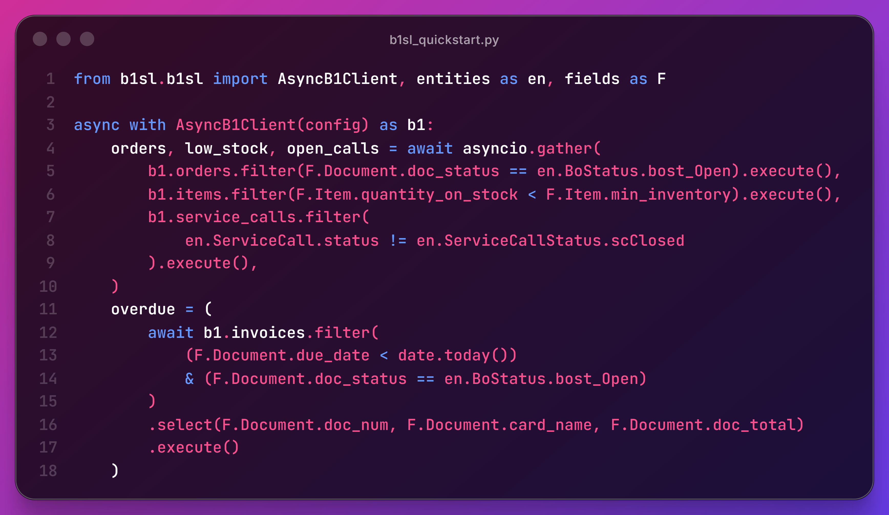

# b1sl-python
### Modern, async-first Python SDK for SAP Business One Service Layer.



[](https://www.python.org/downloads/)
[](https://opensource.org/licenses/MIT)
[](https://docs.pydantic.dev/)
[](https://www.python-httpx.org/)

b1sl is a high-performance SDK designed for the SAP B1 Service Layer, focusing on concurrency, type safety, and efficient session management.

---

## Key Features

*   **Async-First Architecture**: Built on top of `httpx` for non-blocking I/O.
*   **Type Safety**: Full Pydantic v2 integration for all SAP entities.
*   **Smart Session Management**: Automatic 401 re-authentication with internal locking to prevent license exhaustion.
*   **Session Hydration**: Reuse existing `B1SESSION` IDs across serverless functions or Temporal activities.
*   **Optimistic Concurrency**: Automated ETag handling with smart cache invalidation on 412 conflicts.
*   **Pythonic Querying**: Fluent OData builder with operator overloading and type-safe fields.
*   **Observability**: Structured logging and event hooks for performance monitoring.
*   **Safe Development**: Global and per-request **Dry Run** mode to intercept writing requests.

---

## Installation

```bash
# Using pip
pip install b1sl-python

# Using uv
uv add b1sl-python
```

---

## Quick Start

```python
import asyncio
from b1sl.b1sl import AsyncB1Client, B1Config

async def main():
    config = B1Config.from_env() 
    
    async with AsyncB1Client(config) as b1:
        # Full type hints for items and major entities
        item = await b1.items.get("I1000")
        
        # 1. Native Pythonic access (snake_case)
        print(f"Item: {item.item_name}")
        
        # 2. Dynamic access by SAP Alias (perfect for UDFs!)
        print(f"Stock: {item.get('QuantityOnStock')}")

if __name__ == "__main__":
    asyncio.run(main())
```

---

## Pythonic Querying

Experience the best way to interact with SAP Service Layer. No more string concatenation!

```python
from b1sl.b1sl.fields import Item
from datetime import date

# Fluent queries are type-safe, readable, and support IDE autocomplete
items = await b1.items.filter(
    (Item.quantity_on_stock > 0) & (Item.valid_from >= date(2024, 1, 1))
).select(
    Item.item_code, 
    Item.item_name
).top(5).execute()

for item in items:
    print(f"[{item.item_code}] {item.item_name}")
```

---

## Advanced Usage: FastAPI Integration

b1sl is optimized for modern web frameworks. We recommend using the Lifespan pattern to share a single connection pool:

```python
from fastapi import FastAPI
from contextlib import asynccontextmanager
from b1sl.b1sl import AsyncB1Client, B1Config

b1_client = None

@asynccontextmanager
async def lifespan(app: FastAPI):
    global b1_client
    config = B1Config.from_env()
    b1_client = AsyncB1Client(config)
    await b1_client.connect()
    yield
    await b1_client.aclose()

app = FastAPI(lifespan=lifespan)

@app.get("/items/{item_code}")
async def get_item(item_code: str):
    return await b1_client.items.get(item_code)
```

---

## Architecture Overview

| Feature | Implementation | Benefit |
| :--- | :--- | :--- |
| **HTTP Engine** | `httpx` (Async/Sync) | Superior performance & timeouts |
| **Data Models** | `Pydantic v2` | Instant validation & IDE autocomplete |
| **Auth** | Auto-retry 401 & Hydration | Zero-downtime session management |
| **Concurrency** | Shared Connection Pool | Prevents SAP License Exhaustion |

---

## Why b1sl?

In production environments, SAP Business One Service Layer is sensitive to session limits and licensing costs. Traditional wrappers often create redundant connections, leading to overhead and frequent auth failures. 

**b1sl** addresses these issues through:
1. **Session Persistence**: Maintaining long-lived sessions and performing atomic re-authentication.
2. **Resource Efficiency**: Validated Pydantic models reduce runtime exceptions and memory footprint.
3. **Concurrency Control**: Internal locking ensures that concurrent requests wait for a single login attempt instead of triggering multiple auth calls.

---

## SAP Compatibility

This SDK is optimized for modern Service Layer environments and defaults to **v2 (OData V4)**.

*   **Verified Baseline**: Service Layer **1.27** (SAP 10.0 FP 2405).
*   **Minimum for ETags**: Requires Service Layer **1.21+** (March 2021).
*   **Backward Compatibility**: Supports **v1 (OData V2)** through client configuration.

For a detailed history of Service Layer features and specific version support, see the [Full Compatibility Timeline](https://github.com/operator-ita/b1sl-python/blob/main/docs/02-compatibility.md).

---

## Contributing

Contributions are welcome. Please open an issue to discuss proposed changes before submitting a pull request.

---

## License

MIT © 2026.
