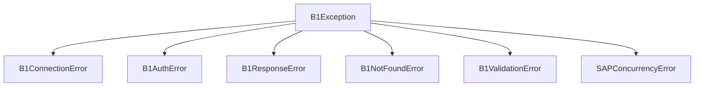

# Error Handling

The SAP B1 Python SDK provides a structured exception hierarchy to help you build resilient integrations. All exceptions are located in `b1sl.b1sl.exceptions`.

## Exception Hierarchy

All library-specific exceptions inherit from `B1Exception`.



### 1. `B1Exception` (Base)
The catch-all exception. Use this if you want a broad safety net. It contains a `details` attribute with the raw SAP error body (if available).

### 2. `B1NotFoundError` (404)
Raised when a specific resource (e.g., an Item or Business Partner) does not exist in SAP.
- **Typical Use**: Checking existence or handling missing data gracefully.
- **Example**:
  ```python
  try:
      item = client.items.get("NONEXISTENT")
  except B1NotFoundError:
      print("Item was not found!")
  ```

### 3. `B1ValidationError` (400)
Raised when the Service Layer rejects a request due to invalid data, missing required fields, or business rule violations.
- **Typical Use**: Debugging payload issues or catching user input errors.

### 4. `SAPConcurrencyError` (412)
Raised when an optimistic concurrency conflict occurs (ETag mismatch).
- **Typical Use**: Implementing retry loops for high-concurrency environments.
- **See also**: [05-interaction-patterns.md](05-interaction-patterns.md) for details on the "Elite" concurrency strategy.

### 5. `B1AuthError` (401)
Raised when authentication fails (invalid credentials) or when a session has expired and cannot be automatically refreshed.

## Automatic Mapping

The SDK's adapters (`RestAdapter` and `AsyncRestAdapter`) automatically map HTTP status codes to these specialized exceptions:

| HTTP Status | Exception Class |
|-------------|-----------------|
| 400 | `B1ValidationError` |
| 401 | `B1AuthError` |
| 404 | `B1NotFoundError` |
| 412 | `SAPConcurrencyError` (with OData code -2039) |
| others | `B1Exception` |

## The `exists()` Pattern

For high-level resources, you can use the built-in `.exists()` method which internally handles `B1NotFoundError`:

```python
if client.business_partners.exists("C1000"):
    print("Socio exists!")
else:
    print("Socio is missing.")
```

> [!IMPORTANT]
> The `exists()` method performs a full GET request to verify existence. It is designed to be compatible across different Service Layer versions.
